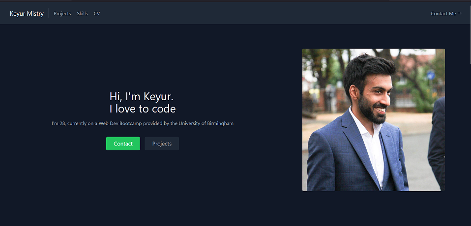

# React-Portfolio

## Table of Contents

- [Description](#description)
- [Installation](#installation)
- [Initialisaton](#initialisation)
- [Media](#media)
- [License](#license)
- [Contributing](#contributing)
- [Tests](#tests)
- [Questions](#questions)

## Description

For this assignment we had to create a functioning front end React app portfolio. Tailwind was used for the CSS and was then deployed to GitHub pages.

Deployed link:http://keyurmist.github.io/React-Portfolio

## Installation

Please follow the instructions on how to install the application:

```
Clone the repo
npm install
```

## Initialisation

Please follow the instructions below to run the application:

```
Change to the portfolio directory
nodemon or npm start
```

## Media

Below is the start of the portfolio page:


## License

This Project is licensed under MIT 

## Contributing

Ways to contribute to the project include:

none

## Tests

Follow the instructions below:

none

## Questions

You can e-mail me at: keyurmist@gmail.com

Visit my GitHub 
